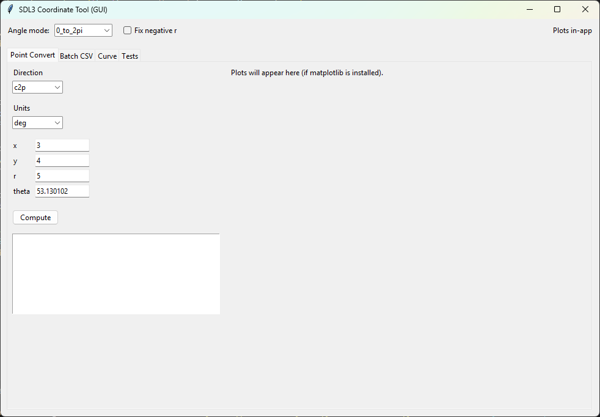
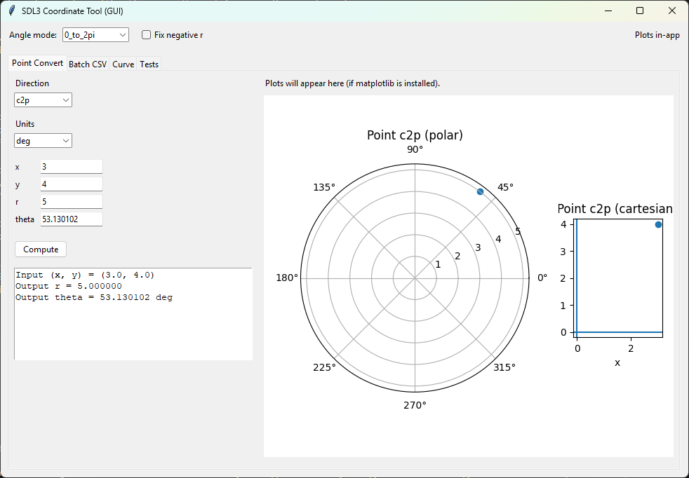
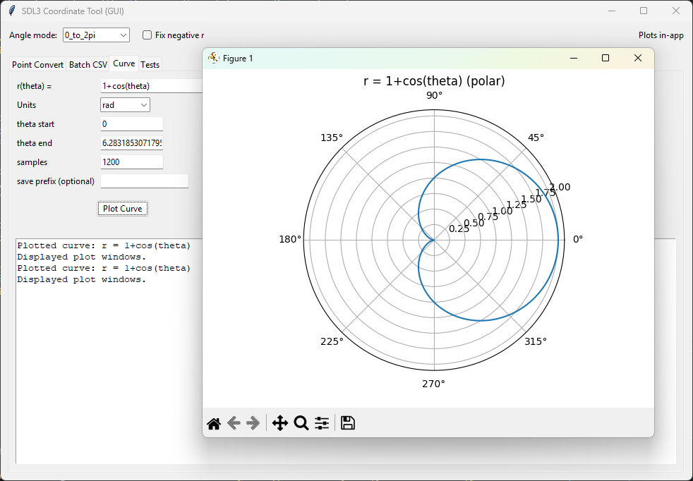

# Polar Graphing GUI

## Screenshots

This project is a Python-based graphical tool that:

- Converts Cartesian coordinates (x, y) to Polar (r, θ)
- Converts Polar coordinates (r, θ) to Cartesian (x, y)
- Plots polar curves such as r = 1 + cos(theta)
- Displays the resulting graph using matplotlib

## Features

- Simple graphical interface
- Accurate coordinate conversion
- Polar curve visualization
- Error handling for invalid inputs

## Example Tests

Cartesian to Polar:
(3, 4) → r = 5

Polar Curve Example:
r = 1 + cos(theta)

These examples demonstrate accurate coordinate conversion and curve visualization.

## How to Run

1. Install Python
2. Install matplotlib (if needed):
   pip install matplotlib
3. Run:
   python sdl3.py
